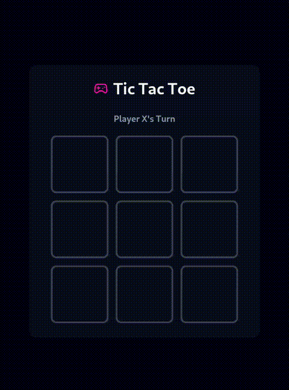

# 🎮 Tic Tac Toe - Jogo da Velha em React

## Demonstração

  

Um jogo da velha clássico desenvolvido com React, TypeScript e Tailwind CSS, com animações fluidas e design responsivo.

## Funcionalidades

- Alternância automática entre jogadores X e O
- Detecção instantânea de vitória ou empate
- Destaque visual da linha vencedora
- Botão de reinício com animação
- Design totalmente responsivo

## Tecnologias

<p align="left">
  
  
  
  
</p>

## Como Executar

1. Clone o repositório:
```bash
git clone https://github.com/Kamila-Silvva/tic-tac-toe
   ```

2. Acesse a pasta do projeto:
```bash
cd tic-tac-toe
  ```

3. Instale as dependências:
```bash
npm install
   ```

3. Inicie o servidor de desenvolvimento:
```bash
npm run dev
   ```

4. Acesse no navegador:
```bash
http://localhost:5173
   ```

## Regras do Jogo

- O jogador X sempre começa
- Os jogadores alternam clicando nos quadrados vazios
- Vence quem alinhar 3 símbolos iguais (horizontal, vertical ou diagonal)
- Empate quando todos os quadrados são preenchidos sem vencedor

## Licença

Este projeto está licenciado sob a licença MIT - veja o arquivo [LICENSE](LICENSE) para detalhes.